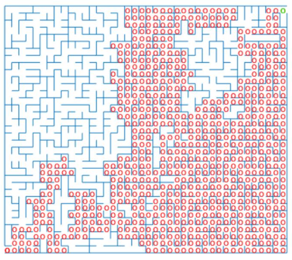

# Maze-Pathfinding

#### Objective is to solve the maze

### Motion planning using two common algorithms:
#### 1. Depth First Search (DFS)
#### 2. Breadth First Search (BFS)

### Comparison of DFS and BFS

The key diffrence between the DFS and BFS algorithms is that the Depth First Search uses Last-In-First-Out que structure; while the Breadth First Search uses First-In-First-Out que structure. Visually, this can be seen by the observation that the DFS prioritizes on exploring the inner branches or inner network, while the BFS prioritizes on exploring the outer branches before proceeding deeper in the network.
